<script async>
window.MathJax = {tex: {inlineMath: [['$', '$'], ['\\(', '\\)']]},svg: {fontCache: 'global'},jax: ["input/TeX", "output/CommonHTML"]};(function () {var script = document.createElement('script');script.src = 'https://cdn.jsdelivr.net/npm/mathjax@3/es5/tex-svg.js';script.async = true;document.head.appendChild(script);})();
</script>

# Concepts I find cool
{: .no_toc }

These are things I learnt during classes, projects, or workshop, and I find them cool, fascinating, or useful. I hope you do too.

## Table of Contents
{: .no_toc }

1. TOC
{:toc}


{: .note-title }
> **A note on CS/programming concepts**
> 
> I maintain a separate website for CS/programming concepts.. Even though it was designed for the CAIE Computer Science syllabus, it is useful for anyone learning CS/programming. You can find it at [https://eccentricOrange.github.io/CAIE-Computer-Science/](https://eccentricOrange.github.io/CAIE-Computer-Science/). I won't cover as many CS/programming concepts here.

## Differential pairs
Think about a signal travelling in a wire. Specifically, think of a digital signal, which is just a voltage that is either high or low (1 or 0, 5V or 0V etc). This is called a **single-ended signal**, because it is referenced to a single point, usually ground.

Now, let's do a weird thing. Let's take another wire, and copy the above signal onto it, but with the opposite polarity. So if the first wire is at 5V, the second wire is at 0V, and vice versa. This is called a **differential signal**, because it is referenced to two points, and the voltage between them is what matters.


(image from [allaboutcircuits](www.allaboutcircuits.com))

At this point, let's assume that there is some noise in our signal.

The single-ended signal is referenced to ground, so the noise is added to the signal. This is bad, because it means that the noise is now part of the signal, and we can't tell them apart.


(image from [LinkedIn](https://www.linkedin.com/pulse/what-differential-signaling-why-use-it-alexander-witkowski/))

The differential signal is referenced to itself, so the noise is added to the signal, but also to its "opposite". Guess what? We can simply subtract the two signals, and the noise will cancel out, leaving us with the original signal!


(image from [WikiMedia](https://commons.wikimedia.org/wiki/File:DiffSignaling.png))


This is why differential signals are used in many applications, such as USB, Ethernet, and HDMI. They are also used in high-speed digital circuits, such as FPGAs and microprocessors.

### Read more
*   [_What Are Differential Pairs and Differential Signals?_, article by Altium](https://resources.altium.com/p/what-are-differential-pairs-and-differential-signals)
*   [_The Why and How of Differential Signaling_, article by All About Circuits](https://www.allaboutcircuits.com/technical-articles/the-why-and-how-of-differential-signaling/)
*   [Definition of differential signaling, Analog Devices](https://www.analog.com/en/design-center/glossary/differential-signal.html)
*   [_How does a USB keyboard work?_, YouTube video by Ben Eater](https://www.youtube.com/watch?v=wdgULBpRoXk)
*   [_Analyzing actual Ethernet encoding \| Networking tutorial (4 of 13)_, YouTube video by Ben Eater](https://www.youtube.com/watch?v=i8CmibhvZ0c)

## Understanding Object-oriented Programming

{: .note-title }
> I gave the following explanation in a [Reddit comment](https://www.reddit.com/r/CodingHelp/comments/ri7fte/oop_python/howj7xn/?context=3).

{: .tldr }
> These are takeaways that you should incorporate over long periods. But for getting a practical understanding, you do need to read all of it.
> * Many languages like Java require you to mess around with objects and classes for everything. This is probably not good design. [Learn more on this opinion](https://www.youtube.com/watch?v=QM1iUe6IofM).
> * In general, when part of your **code actually corresponds to some entity**, then OOP is really useful. Examples: a robot, a motor, a database entry, a message frame, a file.
> * If you're familiar with the relevant word processing, presentation, or spreadsheet software, you've already used OOP. A class is like a **template** (so it lays out the design and structure but doesn't have specific content details) and a specific document is like an instance of that class (so it has specific content details, based on the structure laid out by the template).
> * Most things in Python can be manipulated like an object. This is really useful to know as you develop more advances skills.

I'm going to give you a number of analogies here. Don't dwell too much on any given example, we'll link it to coding later.

BTW, I'm generalizing this answer so that it's about OOP irrespective of languages. But I'll show you a snippet of Python code at the end.

### \#1 Think of a specific chair
* **There are going to be some things about the chair that you can think about.** It will have a height of 1 metre, a mass of 2 kg, a black colour, maybe a memorable dent in the hind leg etc.
* **What does it do?** Nothing really.
* **What can happen to it?** It can be moved around, it can be cleaned, it can be broken (yikes!) etc.

### \#2 Think of a specific bus
I'm imagining my school bus.
* It is yellow, it had seats for 60 people, I'm assuming there's 20 litres of fuel in it right now. It had my school's crest painted on the right side.
* **What does it do?** It can move or brake. It can accelerate or decelerate.
* **What can happen to it?** It can be boarded or deboarded, it can be driven, it can be cleaned etc.

### \#3 Think of a specific human
I'm imagining a fictions friend.
* She's 1.7 m tall, has a mass of 62 kg, is kind, is honest, is extremely lazy.
* **What can she do?** She can study, eat, breathe, run, think etc
* **What can happen to her?** Can be transported somewhere, can be requested something, can fall asleep etc.

### \#4 Now think of all possible chairs
You cannot state the colour of all chairs. It doesn't make sense. You don't know the dents of all chairs. But you do know that all of them will have some colour.

You can clean most of them and you can sit on most of them. But you don't know if you move all of them around—some may be fixed to the floor.

### \#5 Think of all possible buses
Again, you cannot know the colour of all of the buses, but you can be certain that each bus will have a colour. You cannot know the level of fuel of all the buses, but all of them will have some level (even if it's 0).

Most of them can move or brake, but some might be broken. Most of them can be cleaned.

### \#6 Think of all possible humans
I don't know every human's height and mass, but every human has a measurable height and mass. I don't know how lazy most humans are, however.

Almost every human can breathe and eat. Almost every human can fall asleep. Not all of them can run (e.g. paralysed people), but a lot can.

### Takeaways
Do you see what we're doing here?

We're assigning some **properties** (such as the level of fuel in a bus) to each _thing_. When we talk about a specific thing, the property has a **value** (such as 20 litres of fuel in the bus). Some things may not share these properties; e.g., if a bus is still under construction, its fuel tank may not have been installed yet so its level of fuel is undefined.

We're also talking about what they can do or what can be done to them. These are **methods** (basically functions or procedures, depending on what they do). Most humans will have the method that they can breathe. Again, many humans will have the running method, but some will not.

When we're talking about things in general (a generalized chair, for example), we're talking about the **class** of chairs. The chair I'm currently sitting in is an **instance** of that class. Your chair is a different instance of the chair class. If the class chair has a method that they can be cleaned, that both our chairs will "get" that method. This process of creating a specific **object** (such as your chair or my chair) from the class (such as the generalized idea of a chair) is called **instantiating**.

But that's repetitive. When discussing the chairs, I had to state that it can be cleaned even though I already mentioned that when I discussed buses. So lets make a **parent class** of non-living things. We'll say that the class of buses and the class of chairs are both **children** of the class of non-living things. Now if I say that non-living things can be cleaned, all buses and chairs will inherit that.

If there is a specific historical instance of chair sitting in a sterile museum, we don't want people touching it. So for that instance, we can specify that it cannot be cleaned.

### What's this got to do with programming?
See for yourself! (Python 3)

```py
class non_living_things:
    def get_cleaned(self):
        print("Being cleaned.")

class bus(non_living_things):
    colour = ""
    fuel_level = 0.0
    number_of_seats = 0

    def be_driven(self):
        print("Driving.")

    def get_boarded(self):
        print("Getting boarded.")

    def accelerate(self):
        print("Accelerating.")

class chair(non_living_things):
    colour = ""
    mass = 0.0
    height = 0.0

    def get_moved_around(self):
        print("Moving around.")

my_chair = chair()
my_chair.colour = "black"
my_chair.mass = 2
my_chair.height = 1
my_chair.get_cleaned()
my_chair.get_moved_around()

your_chair = chair()
your_chair.colour = "red"
your_chair.mass = 2.7
your_chair.height = 1.5
your_chair.get_cleaned()
your_chair.get_moved_around()

my_bus = bus()
my_bus.colour = "yellow"
my_bus.fuel_level = 20
my_bus.number_of_seats = 60
my_bus.get_cleaned()
my_bus.be_driven()
```

Don't stress on stuff like the word `self` for now, it's a rather nuanced concept.

## Pull-up and pull-down resistors

If you've been doing any amount of electronics, you won't be able to get very far without hearing about pull-up and pull-down resistors. In general, people advise you to use one in one of these situations:
*   When you're reading a button or a switch
*   On the pin of a microcontroller that is connected to a sensor
*   In protocols like I2C.

That said, people often find them a bit confusing (I did too, until somewhat recently). So let's break it down, see how they work with the laws of electricity, and then also see what the deal about weak and strong ones is.

{: .tip }
> **Rules of thumb**
> *   For many circuits, a $10\ \mathrm{k\Omega}$ resistor is a good choice
> *   For weaker pull-up/pull-down resistors, a $100\ \mathrm{k\Omega}$ resistor is a good choice
> *   When using specific protocols, you need to take into account speeds. Lower value resistors are better for higher speeds, but they consume more power.
> *   When using with specific ICs or components, the datasheet will often specify the value of the resistors needed.

### The familiar circuits

Consider that you want to read the state of a button on a microcontroller. You can go about this in two ways:

1.  **Pressing the button is a logic HIGH:** In this case, assume that when the button is not pressed, you read a logic LOW, and when it is pressed, you read a logic HIGH. This is the more common way of doing things.

    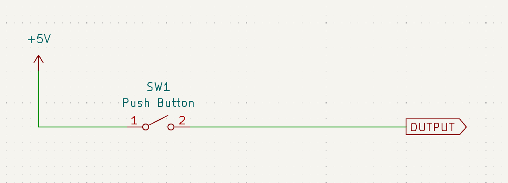

    Think about what happens when the button is not pressed, however. What will the output actually be, since the circuit is open? You might think that if there is no connection to anything, it will be a logic LOW (i.e., GND or 0 V). But recall that a voltage is a potential **difference**. You always measure voltage with respect to something. If you don't connect the pin to anything, it's said to be in a "floating" state. It's not connected to anything, so it can't have a voltage. It's like asking "how far is the that shop?" without saying where you are; one cannot calculate that distance without know the locations of both you and that shop. So the voltage is undefined.

    In practice, this means that the pin can read a logic HIGH even when the button is not pressed. On a microcontroller, oscilloscope, or a logic analyser, you would observe this as noise in the circuit.

    In such a situation, you're usually advised to use a pull-down resistor. We'll analyze a bit later how this works, but for now look at the circuit, and remember that the resistor is connected to ground.

    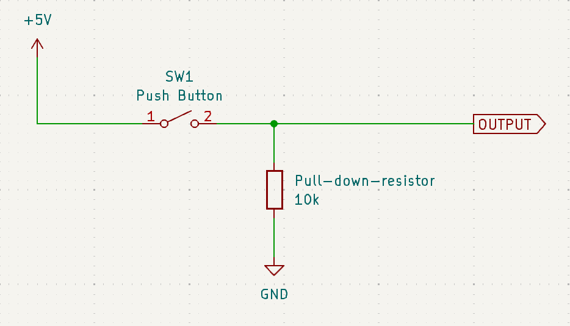

2.  **Pressing the button is a logic LOW:** In this case, assume that when the button is not pressed, you read a logic HIGH, and when it is pressed, you read a logic LOW. This is less common, but it's still used.

    
    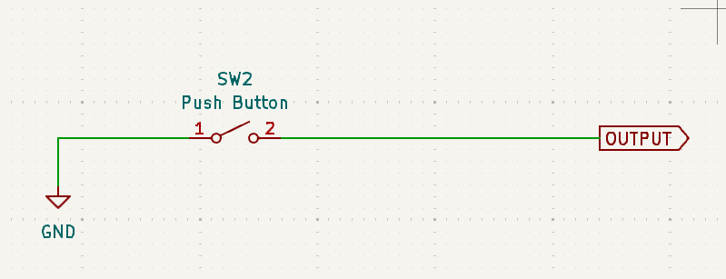

    Similar to the previous case, when the button is not pressed, the voltage is undefined. In this case, you're advised to use a pull-up resistor. We'll analyze this later too, but for now, remember that the resistor is connected to VCC (the positive supply voltage, which in our case is 5V).

    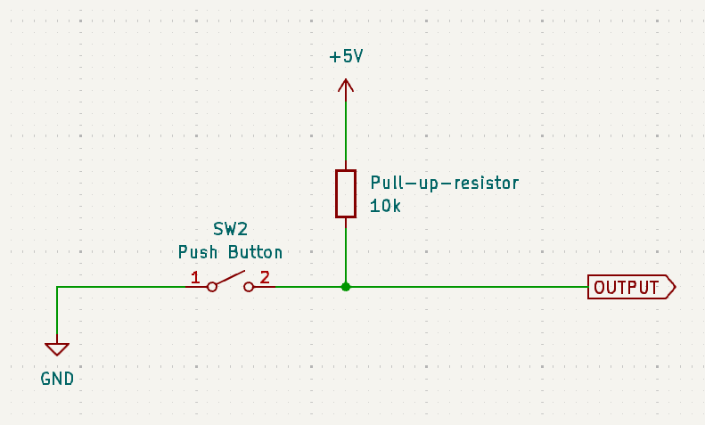


### Pre-requisites: Ohm's Law, Kirchhoff's Laws, and the voltage divider rule

Before we proceed, let's quickly review Ohm's Law and Kirchhoff's Laws, in case you're not familiar with them. Click on the dropdowns to see the explanations.

{: .tip }
> **When we discuss the circuits, it would help you to get a piece of pen and paper, and actually solve for the current and voltage in the circuit. It's worth the effort.**
>
> If you're not familiar with these laws, I would strongly recommend you to practice a few examples by hand. Although I had been using pull-up and pull-down resistors for a several years, their working principles only clicked once I completed *Circuit Theory* and *Analog Electronics* at university, and had a very solid grasp of these laws.

<details markdown="1">

<summary>Ohm's Law</summary>

This is the most fundamental law in electronics. It states that the current flowing through a conductor between two points is directly proportional to the voltage across the two points. The constant of proportionality is the resistance of the conductor. Mathematically,

$$V = IR$$

where:
*   $V$ is the voltage across the conductor
*   $I$ is the current flowing through the conductor
*   $R$ is the resistance of the conductor.

{: .note-title }
> **Example**
>
> What is the voltage across a 10 ohm resistor if a current of 2 amps is flowing through it?
>
> $$V = IR = 2\  \mathrm{A} \times 10\ \mathrm {\Omega} = 20\ \mathrm{V}$$

</details>

<details markdown="1">

<summary>Kirchhoff's Voltage Law (KVL)</summary>

This law states that the sum of the voltages around any closed loop in a circuit is zero. This is a consequence of the conservation of energy.

{: .note-title }
> **What does this mean for us?**
>
> This gives us a very easy way to find the voltage across a resistor. You simple consider the voltage at on both ends of the resistor as $V_1$ and $V_2$, and then write $V_R = V_2 - V_1$. If you know the current, you can find the voltage across the resistor.

In combination with Ohm's law, we can write the voltage across a resistor as:

$$V_2 - V_1 = IR$$

or, the current as

$$I = \frac{V_2 - V_1}{R}$$

where:
*   $V_1$ is the voltage at one end of the resistor
*   $V_2$ is the voltage at the other end of the resistor
*   $I$ is the current flowing through the resistor
*   $R$ is the resistance of the resistor.

</details>

<details markdown="1">

<summary>Kirchhoff's Current Law (KCL)</summary>

This law states that the sum of currents entering a node is equal to the sum of currents leaving the node. This is a consequence of the conservation of charge.

{: .note-title }
> **What does this mean for us?**
>
> This gives us a very easy way to find the current through a multiple resistors when connected in series. It will always be the same!


</details>

<details markdown="1">

<summary>Voltage Divider Rule</summary>
This is a consequence of KVL and KCL. For now, I will not show you how we obtain this rule, but I will show you how to use it. In essence, if you put two resistors in series and apply a voltage across the pair, the voltage across each resistor can be calculated very specifically, and its value depends on the ratio of the two resistors.

{: .note-title }
> **Voltage Divider Rule**
>
> If you have two resistors $R_1$ and $R_2$ in series, and you apply a voltage $V$ across the pair, then the voltage across $R_1$ is
>
> $$V_1 = V \times \frac{R_1}{R_1 + R_2}$$
>
> and the voltage across $R_2$ is
>
> $$V_2 = V \times \frac{R_2}{R_1 + R_2}$$

</details>

{: .important }
> We're assuming `OUTPUT` to be a high-impedance input. This means that it doesn't draw any current from the circuit. This is usually the case with microcontrollers, but not always. If you're using a different device, you should check the datasheet to see if this is the case. This is helpful for our calculations, as you'll see later.

#### Further reading
*   [Ohm's Law](https://www.allaboutcircuits.com/textbook/direct-current/chpt-2/voltage-current-resistance-relate/)
*   [Kirchhoff's Voltage Law](https://www.allaboutcircuits.com/textbook/direct-current/chpt-2/kirchhoffs-voltage-law-kvl/)
*   [Kirchhoff's Current Law](https://www.allaboutcircuits.com/textbook/direct-current/chpt-2/kirchhoffs-current-law-kcl/)
*   [Voltage divider](https://www.electronics-tutorials.ws/dccircuits/voltage-divider.html)
*   [Worked examples](https://www.circuitbread.com/tutorials/solving-circuits-using-kcl-and-kvl-dc-circuits)
*   [Why is high input impedance good?](https://electronics.stackexchange.com/questions/21787/why-is-high-input-impedance-good)

### Pull-down resistors

Let us revisit the circuit with the pull-down resistor. It's easiest to understand how this works simply by analysing the circuit in cases when the switch is pressed and when it is not pressed.


1.  **When the button is not pressed**

    This behaves like an open circuit. So we're simply connecting to the output via a resistor to ground.

    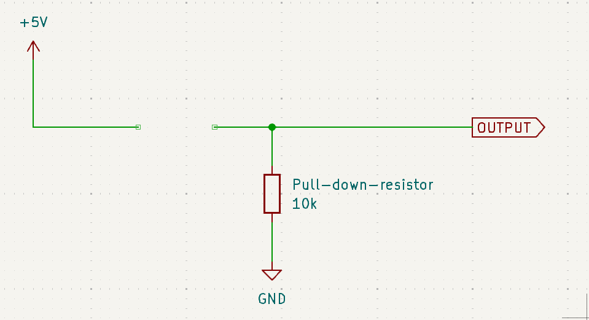

    Now, think about the voltage reading at `OUTPUT`. The output doesn't draw any current, so the current through the resistor is zero.

    On one end of the resistor, we've connected to ground, so the voltage is 0 V. On the other end, we're connected to the output; we don't know this voltage so let's call it $x$. We can already see that the resistance is 10 kilo-ohms. So we can write:

    *   $V_2 = x$
    *   $V_1 = 0$
    *   $R = 10\ \mathrm{k\Omega}$
    *   $I = 0$

    Now using KVL and Ohm's Law, we can write:

    $$V_2 - V_1 = IR$$

    or,

    $$V_2 = V_1 + IR$$

    Substituting in the values, we get:

    $$x = 0\ \mathrm{V} + (0\ \mathrm{A} \times 10\ \mathrm{k\Omega}) = 0\ \mathrm{V}$$

    Therefore, the voltage at `OUTPUT` is 0 V when the button is not pressed, and the circuit reads a logic LOW.

2.  **When the button is pressed**

    This behaves like a short circuit. So we're simply connecting to the output to VCC.

    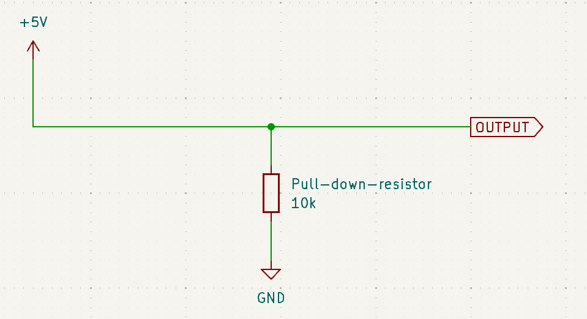

    Now, think about the voltage reading at `OUTPUT`. The output doesn't draw any current, so all the current flows through the resistor only.

    This time, we don't need to find out what the output voltage is. We know that it's connected to VCC, which is 5 V. So our circuit reads a logic HIGH.

{: .important }
> A pull-down resistor makes the default state of the circuit a logic LOW (0 V). Some action (such as a button press) will make the circuit read a logic HIGH (5 V).

### Pull-up resistors

Let us revisit the circuit with the pull-up resistor. It's easiest to understand how this works simply by analysing the circuit in cases when the switch is pressed and when it is not pressed.


1.  **When the button is not pressed**

    This behaves like an open circuit. So we're simply connecting to the output via a resistor to VCC.

    

    Now, think about the voltage reading at `OUTPUT`. The output doesn't draw any current, so the current through the resistor is zero.

    On one end of the resistor, we've connected to VCC, so the voltage is 5 V. On the other end, we're connected to the output; we don't know this voltage so let's call it $x$. We can already see that the resistance is 10 kilo-ohms. So we can write:

    *   $V_2 = 5\ \mathrm{V}$
    *   $V_1 = x$
    *   $R = 10\ \mathrm{k\Omega}$
    *   $I = 0$

    Now using KVL and Ohm's Law, we can write:

    $$V_2 - V_1 = IR$$

    or,

    $$V_2 = V_1 + IR$$

    Substituting in the values, we get:

    $$x = 5\ \mathrm{V} + (0\ \mathrm{A} \times 10\ \mathrm{k\Omega}) = 5\ \mathrm{V}$$

    Therefore, the voltage at `OUTPUT` is 5 V when the button is not pressed, and the circuit reads a logic HIGH.

2. **When the button is pressed**

    This behaves like a short circuit. So we're simply connecting to the output to ground.

    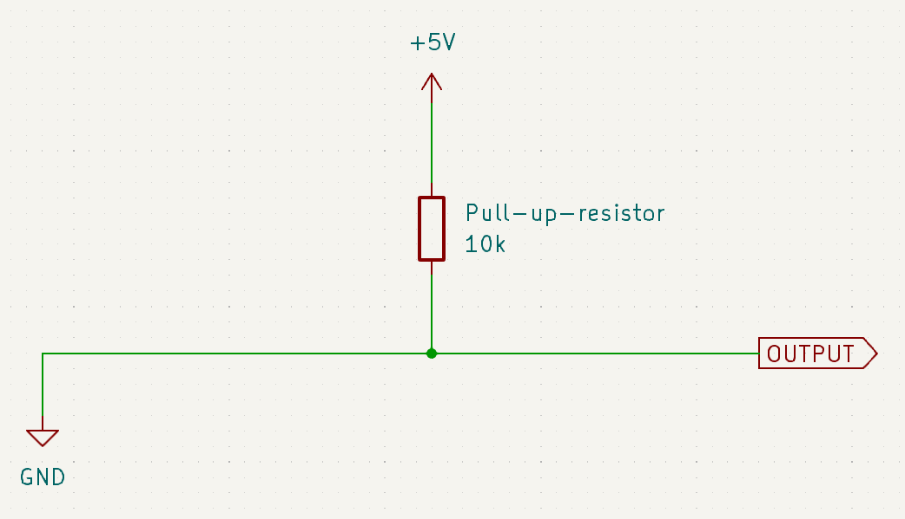

    Now, think about the voltage reading at `OUTPUT`. The output doesn't draw any current, so all the current flows through the resistor only.

    This time, we don't need to find out what the output voltage is. We know that it's connected to ground, which is 0 V. So our circuit reads a logic LOW.

{: .important }
> A pull-up resistor makes the default state of the circuit a logic HIGH (5 V). Some action (such as a button press) will make the circuit read a logic LOW (0 V).

### Weak and strong pull-up/pull-down resistors
The situation above works fine when you have full control of the both the circuit and anything connected to it. But allow me to throw a wrench in the works.

> What if I want to allow someone else to add another pull-up or pull-down resistor, but I still want my circuit to have a default state that I designed?

I ran into this problem fairly recently. I'm designing a circuit board with a professor at my university that is intended to be a development platform for students to learn Control Systems. One of the components requires a certain voltage to be put into sleep or normal mode. We want to add a pull-down resistor to make sure that it works (normal/awake) mode without needing to connect any additional components. However, it deals with somewhat high currents (25 V, 5 A), so it's reasonable to expect that someone might want to add a pull-up resistor to make it sleep by default.

Both goals are fairly reasonable, so we cannot choose one. So how do we do this?

The solution is to use a **weak pull-up or pull-down resistor**. In essence, you can override the default state of the circuit by adding a stronger pull-up or pull-down resistor. But if you don't add anything, the default state is maintained.

It's best we understand this by example, so let's lay down the objectives for one below.
1. We want the default state of our internal circuit to be a logic LOW. This corresponds to using a pull-down resistor.
2. We wish some someone to be able to override this and create another default state by using a pull-up/pull-down resistor of their own.
3. On top of these, if a direct signal is applied (such as a button press or control signal from a microcontroller), it should override both the internal and external resistors.

**Assumptions:**
1.  Our working logic voltage is 3.3 V (not 5 V, as in the previous examples).
2.  Our device registers logic levels in this way: 2.8 V to 3.3 V is a logic HIGH, and 0 V to 0.5 V is a logic LOW. Anything in between is undefined.


*   **Objective 1: Default state is a logic LOW**

    Let's first tackle objective 1. We want to use a pull-down resistor to make the default state of the circuit a logic LOW. We'll use a 100 kilo-ohm resistor for this. Thus, our device looks something like this (anything outside the dashed box is external to the device):

    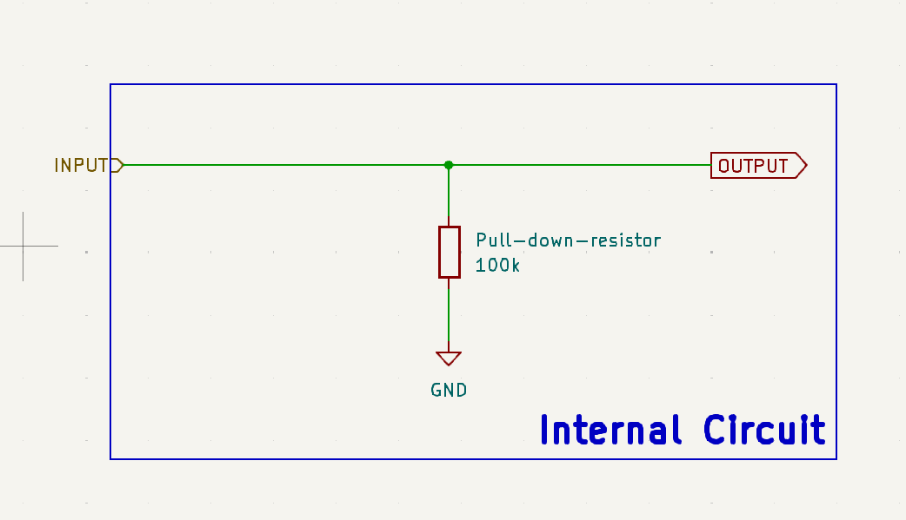

    As we've seen above, this behaves perfectly fine as a normal pull-down resistor. When `INPUT` is either not connected or connected to ground, the voltage at `OUTPUT` is 0 V. When `INPUT` is connected to 3.3 V, the voltage at `OUTPUT` is 3.3 V.

*   **Objective 2: Overriding the default state**

    Now, let's tackle objective 2. We want someone to be able to override the default state by adding a pull-up resistor. Let's say the use an external 10 kilo-ohm pull-up resistor. The circuit now looks like this:

    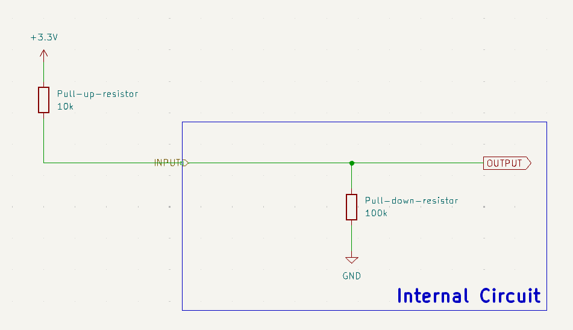

    How do we understand this? Well, if we get rid of the delineation between the internal and external circuits, we see that the two resistors are in series. So we can use the voltage divider rule to find the voltage at `OUTPUT`:

    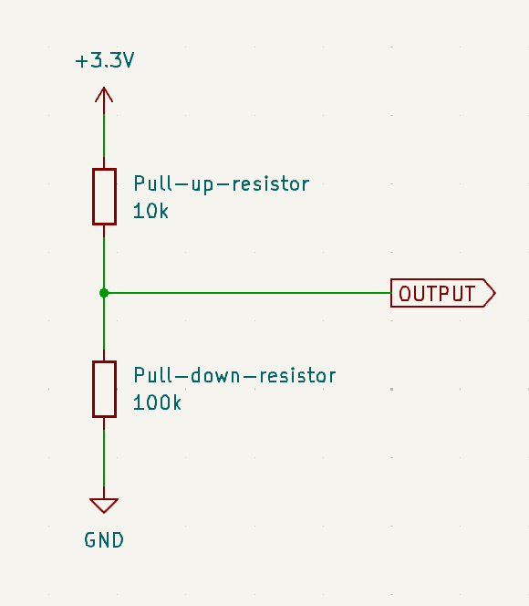

    Using the voltage divider rule, we can write:
    *   $V = 3.3\ \mathrm{V}$
    *   $R_1 = 10\ \mathrm{k\Omega}$
    *   $R_2 = 100\ \mathrm{k\Omega}$

    The voltage at output is the voltage across the 100 kilo-ohm resistor, so we can write:

    $$V_{\text{OUTPUT}} = V \times \frac{R_2}{R_1 + R_2}$$

    Substituting in the values, we get:

    $$V_{\text{OUTPUT}} = 3.3\ \mathrm{V} \times \frac{100\ \mathrm{k\Omega}}{10\ \mathrm{k\Omega} + 100\ \mathrm{k\Omega}} = 3\ \mathrm{V}$$

    Checking our range of logic levels, we see that this is a logic HIGH. So the external pull-up resistor has overridden the internal pull-down resistor.

    As an exercise, you can try to see what happens in the following cases:
    1.  The external resistance is 1 kilo-ohm.
    2.  The external resistance is also 100 kilo-ohm.
    3.  Someone connects another pull-down resistor of 10 kilo-ohm in parallel to the internal pull-down resistor (hint: model this as resistors in parallel).

*   **Objective 3: Overriding both the default state and the external resistor**

    Let's draw this out. We'll consider a signal `CONTROL` that comes from a microcontroller.

    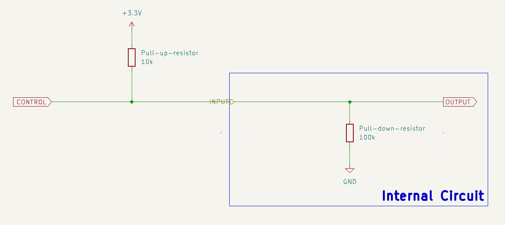

    Well, if we think about it, the control signal is directly connected to `OUTPUT`. So, the voltage at `OUTPUT` is always the voltage at `CONTROL`. Therefore, we don't need to care what happens with the pull-up and pull-down resistors. The control signal will always override them.

### Current and power consumption
Now that we've understood how pull-up and pull-down resistors work, we should keep in mind that they do consume power. This is because they are connected to a voltage source, and current flows through them. The power consumed by a resistor is given by:

$$P = I^2R$$

or equivalently (these give the same result):

$$P = \frac{V^2}{R}$$

where:
*   $P$ is the power consumed by the resistor
*   $I$ is the current flowing through the resistor
*   $V$ is the voltage across the resistor
*   $R$ is the resistance of the resistor.

It's important to know that all resistors have a maximum power rating. If you exceed this power rating, the resistor can get damaged. So it's important to calculate the power consumed by the resistor and ensure that it is within the power rating. In general, most resistors will be rated at either 0.125 W (1/8 W), 0.25 W (1/4 W), or 0.5 W (1/2 W). Some special resistors called power resistors are rated for higher power, but they are usually more expensive and larger in size.

{: .tip }
> **Managing power consumption**
> * Increasing the resistance of the resistor will decrease the power consumed by the resistor. You usually want to pick a resistance such that the power dissipated is about 1/10th of the maximum power rating of the resistor.
> * Designing to work with less than 0.125 W by default means your design will be resilient to changes in the choice of resistor. This is a hallmark of good design.
> * When acting across high voltages, the resistor will consume more power. Choose a higher value resistor in such cases.


### Further reading
*   [Pull-up and pull-down resistors, SparkFun](https://learn.sparkfun.com/tutorials/pull-up-resistors)
*   [Pull-up and pull-down resistors, Adafruit](https://learn.adafruit.com/adafruit-arduino-lesson-6-digital-inputs/pull-up-resistors)
*   [Pull-up and pull-down resistors, Electronics Tutorials](https://www.electronics-tutorials.ws/logic/pull-up-resistor.html)
*   [What makes a pull-up/down resistor strong or weak?](https://electronics.stackexchange.com/questions/76376/what-makes-a-pull-up-down-resistor-strong-or-weak)
*   [How do I calculate the required value for a pull-up resistor?](https://electronics.stackexchange.com/questions/23645/how-do-i-calculate-the-required-value-for-a-pull-up-resistor)
*   [Choosing an Appropriate Pull-up/Pull-down Resistor for Open Drain Outputs](https://www.ti.com/lit/an/slva485/slva485.pdf)