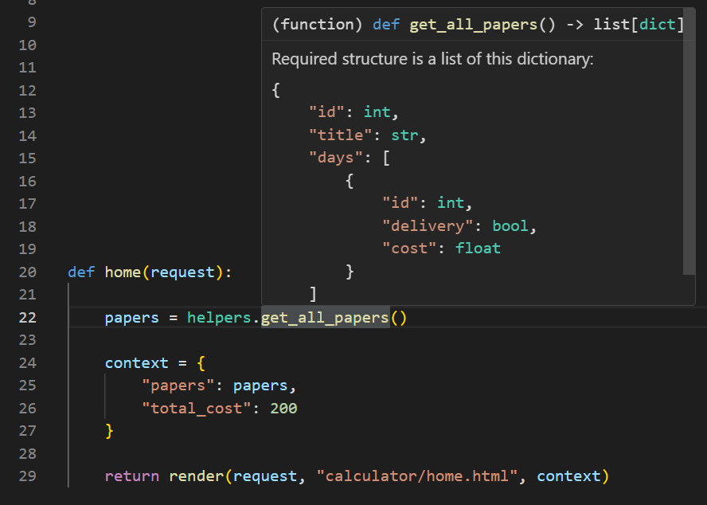
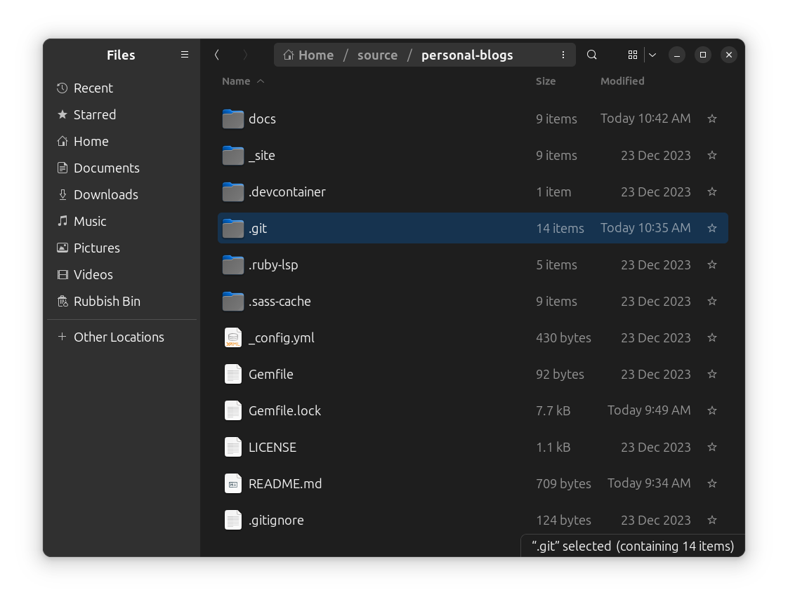
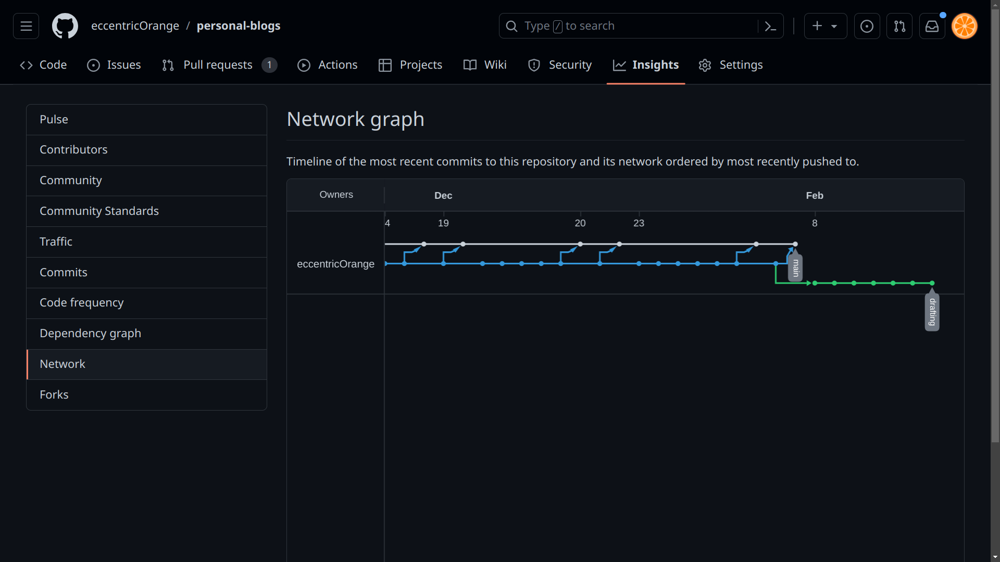

# Random features and tips

## 1. The `any` and `all` keywords in Python

`any` behaves like the mathematical `OR` operator. It takes an iterable and returns `True` if at least one of the elements in the iterable is truthy. [See `any` documentation](https://docs.python.org/library/functions.html#any)

```python
>>> any([0, 1, 2, 3])
True

>>> any([0, False, None])
False

>>> any([0, False, None, 1])
True
```

`all` behaves like the mathematical `AND` operator. It takes an iterable and returns `True` only if all of the elements in the iterable are truthy. [See `all` documentation](https://docs.python.org/library/functions.html#all)

```python
>>> all([0, 1, 2, 3])
False

>>> all([1, 2, 3])
True

>>> all([1, 2, 3, None])
False
```

See the [Python documentation](https://docs.python.org/3/library/functions.html) for more built-in functions.

## 2. Python Docstring
These are strings used for documenting a Python module, class, function or method in a consistent format. They are used to generate online or offline documentation, and editors like VS Code will automatically pick up on them (and [Markdown](https://www.markdownguide.org/) formatting!) to give tooltips. [See `docstring` convention](https://www.python.org/dev/peps/pep-0257/).

Here's an example from a project I'm working on:

```python
def get_all_papers() -> list[dict]:
    """
    Required structure is a list of this dictionary:
    ```py
    {
        "id": int,
        "title": str,
        "days": [
            {
                "id": int,
                "delivery": bool,
                "cost": float
            }
        ]
    }
    ```
    """

    papers = models.Paper.objects.all()

    papers_list = []

    for paper in papers:
        paper_dict = {
            "id": paper.id,
            "title": paper.title,
            "days": []
        }

        costs = models.Cost.objects.filter(paper=paper)

        for cost in costs:
            paper_dict["days"].append({
                "id": cost.id,
                "delivery": cost.delivery,
                "cost": cost.cost
            })

        papers_list.append(paper_dict)

    return papers_list
```

Here is the documentation generated by VS Code:


It may also interest you to look into these:
1.  **Doxygen:** A tool for generating documentation from source code; this is internally used by the example above to some extent. [See Doxygen documentation](https://www.doxygen.nl/).
2.  **Guide to documenting Python code:** A look at the technical aspects of writing documentation for Python code, by Real Python. [Link to article](https://realpython.com/documenting-python-code/)
3.  **Write The Docs:** A community/wiki with information on writing *good* documentation. [Link to website](https://www.writethedocs.org/).

## 3. EEPROM in Arduino
While I have been using micro-controllers for a few years at thing point, I only recently discovered that the Arduino framework has built-in EEPROM support. This is a small amount of memory that can be used to store data that will persist even when the device is powered off. [See `EEPROM` documentation](https://docs.arduino.cc/learn/built-in-libraries/eeprom)

This allows for some really cool behavior, such as storing settings right on the board.

## 4. Named groups in Python regex
For the uninitiated, using regex (regular expressions) is a way of matching patterns in strings. Here are some examples:

```python
## Import the regex module
import re

## An (oversimplified) email regex
email_regex = r"^[a-zA-Z0-9_.+-]+@[a-zA-Z0-9-]+\.[a-zA-Z0-9-.]+$"

# test
print(re.match(email_regex, "someone@example.com"))
print(re.match(email_regex, "someone@example,com"))
```

Since regex is fairly standardized, learning it once means the skill carries well over to other languages. Check out the CS50P episode on regex to learn more: [CS50P - Lecture 7 - Regular Expressions](https://cs50.harvard.edu/python/2022/weeks/7/).

However, Python has a feature called named groups. This allows you to name a group of characters in a regex, and then access them by name. This is useful for extracting data from strings. [See `named groups` documentation](https://docs.python.org/3/howto/regex.html#non-capturing-and-named-groups).

```python
## Import the regex module
import re

## An email regex with named groups
email_regex = r"^(?P<username>[a-zA-Z0-9_.+-]+)@(?P<domain>[a-zA-Z0-9-]+)\.(?P<tld>[a-zA-Z0-9-.]+)$"

# test
match = re.match(email_regex, "someone@example.com")
print(match.group("username"))
print(match.group("domain"))
print(match.group("tld"))
```

## 5.   What do you actually do with Git?
Many programmers have heard of [Git](https://git-scm.com/), and the corresponding online services like [GitHub](https://github.com/), [GitLab](https://gitlab.com/), and [Bitbucket](https://bitbucket.org/). Yet many beginners struggle to use it effectively, and there seems to be need for a standard explanation of how these different tools fit together.

{: .tldr }
> * Git is just a tool (an app, if you will) that tracks changes to a project (called a repository) over time
> * GitHub, GitLab, and Bitbucket are online services that host Git repositories
> * These services provide a way to share your code with others, and use cloud storage without grappling with traditional cloud storage services like Google Drive or Dropbox

{: .warning }
This article doesn't give you resources to actually use Git, as I've discussed that on the [Tools page](tools#1---git-for-source-control). This is only an explanation that specifically addresses the confusion I've seen in beginners.

### Suggested mental model
1.  **Concept of tracking history**

    If you've ever used tools like Google Docs, you're already familiar with the basic idea of tracking changes. 

    

    Source: Zapier

    When you make a change, the software records the change, who made it, and when. In the case of the Google Workspace suite, all of this is neatly packaged in a single file (the document). You're free to view this history, and even revert to an older version if you want.

    Read more: https://support.google.com/docs/answer/190843

2.  **Version Control Systems and Git**

    However, software (source code) files are a little different. Firstly, they're very simple [text files](/misconceptions#deeper-dive-into-types-of-files) so it is impractical to integrate something as complex as a history pane into the file itself. Secondly, software projects are often made up of many files.

    So, most version control systems (like Git) store the history in a separate location, and provide a way to view and revert changes across many files. In fact, Git is capable of keeping track of content (such as a variable or function name) across the various files in a project. In the case of Git, this history is stored in a `.git` folder in the root of the project. You can see that I have one even for this website:

    

    If you wanted to share a Git repository with someone, sharing this folder alone is technically sufficient. It contains all the history and metadata needed to work with the project, up to the latest [commit](https://www.atlassian.com/git/tutorials/saving-changes/git-commit) in every [branch](https://www.atlassian.com/git/tutorials/using-branches). You may enjoy seeing the contents of this folder, and can read about that from [Stack Overflow](https://stackoverflow.com/questions/19749105/what-is-the-git-folder) or [Git's documentation](https://git-scm.com/book/en/Git-Internals-Git-Objects) (though it's not necessary to understand these details to use Git).

    The rest of the root folder contains the actual files of the project, and is called the "working directory". You make changes here, and then "commit" them to the history using the `git` command line tool. Additionally, if you want to switch to a different version of the project, you can "checkout" a different "branch" or "commit". Git then updates the working directory to match the version you selected.

    

    Source: Git documentation

3.  **Online services**
    
    GitHub, GitLab, and Bitbucket are online services that host Git repositories. They provide a way to share your code with others, and use cloud storage without grappling with traditional cloud storage services like Google Drive or Dropbox. They also provide a way to view the history of a project, and to collaborate with others. They do this by providing a web interface to the Git repository, and by providing a way to "clone" the repository to your local machine.

    The web interface analyses the contents of the `.git` folder (optionally, alongside other data), and visualises many aspects of the project. For example, you can see the history of the project, the different branches, and the changes made in each commit. You can also view the contents of the working directory at any point in the history.

    

    

    

    Source: GitHub (this blog's repository)

    When you "clone" a repository, you download a copy of the history (`.git` folder) and working directory to your local machine. You can then make changes, and "push" them back to the online repository. You can also "pull" changes from the online repository to your local machine.

    

    Source: [Reddit](https://www.reddit.com/r/git/comments/99ul9f/git_workflow_diagram_showcasing_the_role_of/)

    