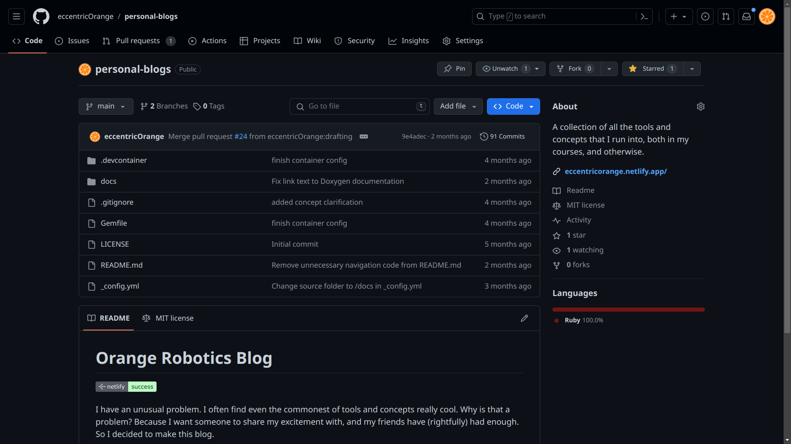
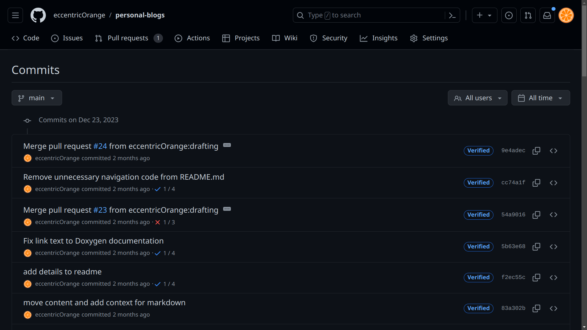

# Misconceptions and Other Exposition

Over time, I've realized that a few topics commonly mess with beginners, and many resources do not address them adequately. This page my attempt to take a stab at it.

##  1. Sorting out environments, source code, and executables
Did you just download an editor, wrote some code, and now you're wondering why it doesn't run? You're not alone.

Among beginners, one of the most common frustrations I've seen has to do with actually setting up your computer to write and run code. Generally speaking, there are three solutions commonly presented to people:
*   having someone else set up the environment for you
*   using an online system, where everything is set up for you
*   using an IDE (Integrated Development Environment), where everything is set up for you in one consolidated program.

However, in the real world, knowing how and where to run your code seems to be fairly important. It may not be on a personal computer at all. Often it's a server where the only available interface is a command line. Another common one is inside another file (such as a [Dockerfile](/tools#2---docker-for-isolating-your-development-environment), or another configuration file). Personally, I've often had to run on embedded targets like [Raspberry Pi](https://www.raspberrypi.org/), or [Arduino](https://www.arduino.cc/) boards. In these cases, you need to know how to set up your environment, and how to run your code.

Let's clearly lay out what computers do fundamentally, how this ties in with coding, and how you can get a computer to run your code.

{: .tldr }
> Make sure you install each of the following:
> *   a text editor/IDE
> *   the build tools for the language of your choice
> *   any extensions for your editor/IDE that you need to use the build tools

### Fact 1: The only type of file a computer can actually run is an executable binary file.

In general, a file may contain either *data* or *instructions*. A file that contains instructions is called an *executable file*. A file that contains data is called a *data file*. A computer can only run executable files. All other files are just data that can be read by a program, but not executed. Typically, the "instruction files" are *binary files*, and we call them *executables*.

{: .important }
Your computer cannot run your source code without the help of another program, typically called a *compiler* or *interpreter*.

<details markdown="1">

<summary>More details and further resources</summary>

#### Deeper dive into types of files

<dl>

<dt>File</dt> <dd><p markdown="1">You probably already know this. To use a definition, a file is _a file is a collection of computer data that forms a single unit and is given a particular name_ \[[Britannica](https://www.britannica.com/dictionary/file)\]. All your documents, code, apps, photos, videos, songs etc that are stored on computers are in fact files.</p></dd>
<dt>Binary file</dt> <dd><p  markdown="1">Fundamentally, files are of two types to a computer. A *binary file* is a type of file that contains data in a format that can be understood by a computer, unlike a *text file* that has characters encoded with a scheme like [ASCII](https://en.wikipedia.org/wiki/ASCII) or [UNICODE](https://en.wikipedia.org/wiki/Unicode). For example, the number 23 would stored as a separate "2" and a "3" in a text file (2 bytes long), but in a binary file it would be converted to a sequence of bits that represent the value 23 (1 byte long).</p></dd>
<dt>Executable file</dt> <dd><p markdown="1">An executable file is a binary file that contains instructions that a computer can execute. These instructions are encoded in a format that the computer can understand. This is the only type of file that a computer can actually run. All other files are just data that can be read by a program, but not executed.</p></dd>

</dl>

However, you may have noticed that when you double-click a file (such as a document or an image), it opens. However, most computers just happened to be configured that way for convenience. In reality, the computer is running a program that can read the file and display it to you. That program is an executable binary, and it helps the CPU process the file for you. Your source code behaves in much the same way, and typically needs some other executable to process it.

#### Further resources
*   [_What are Executables? \| bin 0x00_ by YouTube channel PWNFunction](https://www.youtube.com/watch?v=WnqOhgI_8wA)
*   [_What is a File Format?_ by YouTube channel LiveOverflow](https://www.youtube.com/watch?v=VVdmmN0su6E)

</details>

### Fact 2: IDE vs Compiler/Interpreter vs Source Code vs Terminal
If you take any formal computer science course, you might hear about two ways of converting your code (such a C++, Python, or Java source file) into something a computer can understand: using [compilers or interpreters](https://www.programiz.com/article/difference-compiler-interpreter). In both cases, you use an executable with your source code. That executable then either runs your code (interpreter case) or gives you another executable you can run (compiler case).

{: .important }
> This process is independent of your IDE/editor. You **must have the interprerer/compiler installed** in order for your editor to be able to do anything with it. Your editor is just a tool that helps you write code.
> 
> <details markdown=1>
>
> <summary>IDE vs text editor</summary>
> 
> <p markdown=1> To be completely honest, this is true for **text editors**, but an **IDE (integrated development environment)** is a different story. An IDE is a program that combines a text editor with a compiler/interpreter, and other tools. In this case, the IDE automatically installs the compiler/interpreter and often runs is behind the scenes too. That said, the distinction between text editors and IDEs is often blurred for modern software. [Read more](https://www.javatpoint.com/ide-vs-code-editor)</p>
>
> </details>

If we look at a command line interface, we can see this very clearly. We can run our code, and then use the [`ls`](https://www.digitalocean.com/community/tutorials/ls-command-in-linux-unix) command to see the files in our folder.

<details markdown="1">
<summary>Interpreted example: Python</summary>

Let's say I have the following source code in a file called `hello.py`. Don't worry if you don't understand it, it's just a simple Python program that writes the text "Hello, world!" to the screen.

```python
print("Hello, world!")
```

The Python interpreter I have installed on my computer is called `python3`. I can use it to run my code.

```bash
$ python3 hello.py
Hello, world!
```

Notice that it doesn't generate any files. It just runs my code.

```bash
$ ls -l
total 4
-rw-rw-rw- 1 eo eo 29 Oct 22 06:59 hello.py
```

See what happens here. An executable called `python3` is run, and it takes one argument: `hello.py`. The first argument is the source code file, and the second argument is the name of the executable file that will be generated. The interpreter then runs my code.
</details>

<details markdown="1">
<summary>Compiled example: C++</summary>
This is a little bit more elaborate, but let's go through it step by step.

Let's say I have the following source code in a file called `hello.cpp`. Don't worry if you don't understand it, it's just a simple C++ program that writes the text "Hello, world!" to the screen.

```cpp
#include <iostream>

int main() {
    std::cout << "Hello, world!\n";
    return 0;
}
```

The C++ compiler I have installed on my computer is called `g++`, and is a part of the [GNU Compiler Collection](https://gcc.gnu.org/). I can use it to compile my code into an executable binary file called `hello`. I can then run this file to execute my code.

```bash
$ g++ hello.cpp -o hello
```

As expected, I have two files in my folder now: `hello.cpp` and `hello`.

```bash
$ ls -l
total 20
-rwxrwxrwx 1 eo eo 16384 Oct 22 07:04 hello
-rw-rw-rw- 1 eo eo    87 Oct 22 07:04 hello.cpp
```

See what happens here. An executable called g++ is run, and it takes two arguments: `hello.cpp` and `-o hello`. The first argument is the source code file, and the second argument is the name of the executable file that will be generated. The compiler then generates an executable file called `hello`, which I can run.

```bash
$ ./hello
Hello, world!
```
</details>

### So what does this mean for you?
If you have understood up till this point, congratulations! These concepts are often fairly confusing, and it's completely okay if you don't understand them yet. You'll get it eventually, once you have some more experience of software development.

That being said, these give us a fundamental understanding which we can build upon to set up a computer for development.

You can, of course, do things differently, but I would recommend the following approach to setting up your computer to learn most languages:
1.  **Install a text editor/IDE.** I use [Visual Studio Code](https://code.visualstudio.com/), but you can use any editor you like. Check out my [older article on editors](https://eccentricorange.github.io/CAIE-Computer-Science/things-to-know.html#using-an-ide) for more details.
2.  **Install the build tools for the language of your choice.** The term "build tools" or "SDK (software development kit)" are general words for a bunch tools, crucially including the interpreter/compiler that you need to run your code. The steps to do this vary both from one language to another, and from one operating system to another. In general, search for what you need, and follow the instructions. If you're using an IDE, it will often do this for you.
3.  **[IF RELEVANT] Set up your text editor/IDE to use the build tools.**
    *   If you use a text editor like VS Code, [vim](https://www.vim.org/), [Notepad++](https://notepad-plus-plus.org/), or any of the hundreds of others, you will need to set it up to use the build tools. Often you do this by installing the relevant extensions in your editor. Look up a tutorial online for configuring this.
    *   If you installed an IDE like [Visual Studio](https://visualstudio.com/) or one of the [JetBrains IDEs](https://www.jetbrains.com/products/) instead, it will likely have done this for you. If not, look up a tutorial online for configuring it.
4.  **Make projects in folders, not files.** This is a good habit to get into, and will help you keep your code organized. It will also help you if you ever need to use a build system like [Make](https://www.gnu.org/software/make/) or [source control tools](https://eccentricorange.github.io/CAIE-Computer-Science/things-to-know.html#source-control). I recommend you make a folder for each project, and put all the files for that project in that folder. This includes your source code, any libraries you use, and any build files. Additionally, most IDEs/editors are designed with larger projects in mind, and will work better if you use them this way.

<details markdown="1">
<summary>Exceptions</summary>

Many systems (especially proprietary ones) have their own way of doing things. For example, [MATLAB](https://www.mathworks.com/products/matlab.html) has its own IDE, and you can't really use it without it. Similarly, [Arduino](https://www.arduino.cc/) has its own IDE (even though it is open-source). Then there are things like [LabVIEW](https://www.ni.com/en-in/shop/labview.html), which aren't traditional text-based languages to begin with. In these cases, you will have to use the IDE, and it will take care of everything for you.

</details>

### Resources
I'll list out what I consider the best resources for some of the most common languages, but this obviously doesn't cover every use case, so you're generally better off searching for what you need.

<dl>

<dt>Learning Programming</dt>

<dd markdown="1">

*   [r/learnprogramming Wiki](https://www.reddit.com/r/learnprogramming/wiki/): This has curated lists for multiple languages and platforms, and is a great place to start.
*   [CS50 for CS intro and a little bit C](https://cs50.harvard.edu/)
*   [CS50P for Python](https://cs50.harvard.edu/python)
*   [_Beginning C++ Programming - From Beginner to Beyond_ on Udemy by Tim Buchalka](https://www.udemy.com/course/beginning-c-plus-plus-programming/)
*   [Java from Oracle](https://education.oracle.com/products/ls_40805)
*   [C# from Microsoft](https://docs.microsoft.com/en-us/learn/paths/csharp-first-steps/)
*   [Web Development from Mozilla](https://developer.mozilla.org/en-US/docs/Learn)

</dd>

<dt>Tooling</dt>

<dd markdown="1">

*   [_Missing Semester_ by MIT CSAIL](https://missing.csail.mit.edu/)
*   [_Bash in 100 Seconds_ by YouTube channel Fireship](https://www.youtube.com/watch?v=I4EWvMFj37)
*   [Setting up languages in VS Code](https://code.visualstudio.com/docs/languages/): The VS Code team has documented the process of setting up the following languages with their editor (at the time of writing):

    C++, C#, CSS, Dart, Dockerfile, F#, Go, HTML, Java, JavaScript, JSON, Julia, Less, Markdown, PHP, PowerShell, Python, R, Ruby, Rust, SCSS, T-SQL, TypeScript

    **Ensure that you follow through with the process they describe, and don't just install the extensions.** This is because the extensions often require the build tools to be installed, and will not work without them.

</dd>

</dl>

## 2.   What do you actually do with Git?

{: .warning }
> This article doesn't give you resources to actually use Git, as I've discussed that on the [Tools page](tools#1---git-for-source-control). This is only an explanation that specifically addresses the confusion I've seen in beginners.

Many programmers have heard of [Git](https://git-scm.com/), and the corresponding online services like [GitHub](https://github.com/), [GitLab](https://gitlab.com/), and [Bitbucket](https://bitbucket.org/). Yet many beginners struggle to use it effectively, and there seems to be need for a standard explanation of how these different tools fit together.

{: .tldr }
> * Git is just a tool (**an app,** if you will) that tracks changes to a project (called a repository) over time
> * GitHub, GitLab, and Bitbucket are online services that **host Git repositories**
> * These services provide a way to **share your code** with others, and use cloud storage without grappling with traditional cloud storage services like Google Drive or Dropbox


### Suggested mental model
1.  **Concept of tracking history**

    If you've ever used tools like Google Docs, you're already familiar with the basic idea of tracking changes. 

    

    Source: Zapier

    When you make a change, the software records the change, who made it, and when. In the case of the Google Workspace suite, all of this is neatly packaged in a single file (the document). You're free to view this history, and even revert to an older version if you want.

    Read more from [Google's support page](https://support.google.com/docs/answer/190843).

2.  **Version Control Systems and Git**

    However, software (source code) files are a little different. Firstly, they're very simple [text files](/misconceptions#deeper-dive-into-types-of-files) so it is impractical to integrate something as complex as a history pane into the file itself. Secondly, software projects are often made up of many files.

    So, most version control systems (like Git) store the history in a separate location, and provide a way to view and revert changes across many files. In fact, Git is capable of keeping track of content (such as a variable or function name) across the various files in a project. In the case of Git, this history is stored in a `.git` folder in the root of the project. You can see that I have one even for this website:

    

    If you wanted to share a Git repository with someone, sharing this folder alone is technically sufficient. It contains all the history and metadata needed to work with the project, up to the latest [commit](https://www.atlassian.com/git/tutorials/saving-changes/git-commit) in every [branch](https://www.atlassian.com/git/tutorials/using-branches). You may enjoy seeing the contents of this folder, and can read about that from [Stack Overflow](https://stackoverflow.com/questions/19749105/what-is-the-git-folder) or [Git's documentation](https://git-scm.com/book/en/Git-Internals-Git-Objects) (though it's not necessary to understand these details to use Git).

    The rest of the root folder contains the actual files of the project, and is called the "working directory". You make changes here, and then "commit" them to the history using the `git` command line tool. Additionally, if you want to switch to a different version of the project, you can "checkout" a different "branch" or "commit". Git then updates the working directory to match the version you selected.

    

    Source: Git documentation

3.  **Online services**
    
    GitHub, GitLab, and Bitbucket are online services that host Git repositories. They provide a way to share your code with others, and use cloud storage without grappling with traditional cloud storage services like Google Drive or Dropbox. They also provide a way to view the history of a project, and to collaborate with others. They do this by providing a web interface to the Git repository, and by providing a way to "clone" the repository to your local machine.

    The web interface analyses the contents of the `.git` folder (optionally, alongside other data), and visualizes many aspects of the project. For example, you can see the history of the project, the different branches, and the changes made in each commit. You can also view the contents of the working directory at any point in the history.

    

    

    

    Source: GitHub (this blog's repository)

    When you "clone" a repository, you download a copy of the history (`.git` folder) and working directory to your local machine. You can then make changes, and "push" them back to the online repository. You can also "pull" changes from the online repository to your local machine.

    

    Source: [Reddit](https://www.reddit.com/r/git/comments/99ul9f/git_workflow_diagram_showcasing_the_role_of/)


    Most of these services also provide tons of services aside from hosting code and collaborating. Check those out on their respective websites:
    *   [GitHub](https://github.com/features)
    *   [GitLab](https://about.gitlab.com/)
    *   [BitBucket](https://bitbucket.org/product)

4.  **Integration with your IDE/editor**
    
    Many IDEs and text editors have built-in support for Git. This means you can view the history of a project, make commits, and push/pull changes without leaving the editor. This is a huge productivity boost, as it means you don't have to context switch between the editor and the command line.

    Generally speaking, these provide a GUI (much like one of the hosting service websites). Under the hood, they're often just running the same `git` commands that you would run in the command line, though. Moreover, for advanced functionality, you may still need to use the command line, so it's a good idea to learn the basics of Git.

    

    Source: VS Code documentation

    This is a very high-level overview, and there are many more details to learn about Git. However, I hope this gives you a good starting point for understanding how Git fits into the world of software development.

    Learn more from [VS Code Docs](https://code.visualstudio.com/docs/sourcecontrol/intro-to-git).

<details markdown="1">

<summary> No Sponsorships </summary>

I mention products like VS Code fairly frequently. I want to make it clear that I am **not sponsored** by any of these companies, and I do not receive any compensation for mentioning them. I mention them because I use them, and I think they are good products. 

</details>