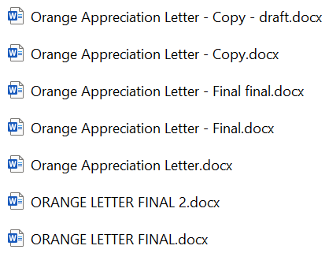

# Tools that I use in my work

I use most of the tools listed below regularly in my work as an electrical engineering student passionate about robotics. I find all of these fascinating, and would like to share that with you. Some of these are really standard tools that you'll find in any engineer's toolbox, while others are more niche. I hope you find something useful here.

Note that nothing here is sponsored, and I am not affiliated with any of the companies that make these tools. I just like them.

## 1.   Git for source control

{: .warning }
> This article is just an introduction, followed by a comprehensive list of resources to learn Git. For an explanation of the common misconceptions surrounding Git, see the [other article](/misconceptions#2---what-do-you-actually-do-with-git).


How often have you had to deal with this?



I did pretty often. I've often lost track of which version of a document was the latest, and which one was the one I was supposed to be working on; and on occasion, I've even lost weeks of work because I accidentally overwrote a file.

Any of you that have used [Google Docs](https://docs.google.com/) or similar online tools would be [laughing at me right now](https://support.google.com/a/users/answer/13004165?hl=en). But how do you do the same thing for *any* file on your computer, not just the ones that are supported by Google's office suite? This doesn't make sense for a document, but for a technical project, you could very well have multiple versions that are developed in parallel, and you need to keep track of all of them.

Enter [Git](https://git-scm.com/). Git is a source control system that allows you to keep track of all the changes you make to a file, and revert to any version you want. It's also great for collaborating with others, as it allows you to merge changes made by multiple people to the same file. It's by far the most popular [version control system (VCS)](https://about.gitlab.com/topics/version-control/) out there today.

### Resources to understand what Git is
Just pick one of these and read/watch it, these are just an overview.
*   [Atlassian article on version control](https://www.atlassian.com/git/tutorials/what-is-version-control)
*   [Wikipedia article on version control](https://en.wikipedia.org/wiki/Version_control)
*   [Atlassian article on Git](https://www.atlassian.com/git/tutorials/what-is-git)
*   [_Git Explained in 100 Seconds_, YouTube video by Fireship](https://www.youtube.com/watch?v=hwP7WQkmECE)

### Resources to learn how to use Git
*   [_Git & GitHub Tutorial for Beginners_, YouTube playlist by Net Ninja](https://youtube.com/playlist?list=PL4cUxeGkcC9goXbgTDQ0n_4TBzOO0ocPR) (this is what I used when I learnt Git)
*   [_Getting started with Git and GitHub_, article by GitHub](https://docs.github.com/en/github/getting-started-with-github)
*   [_Git It? How to use Git and Github_ by Fireship on YT](https://www.youtube.com/watch?v=HkdAHXoRtos)
*   [Official Git documentation](https://git-scm.com/docs/gittutorial)

### Important concepts you should look into
*   [GitHub](https://github.com/)/[GitLab](https://about.gitlab.com/) or other Git hosting services
*   Git branching
    *   [Official Git documentation on branching](https://git-scm.com/book/en/Git-Branching-Branches-in-a-Nutshell)
    *   [Atlassian article on branching](https://www.atlassian.com/git/tutorials/using-branches)
*   [Issues](https://docs.github.com/en/issues/tracking-your-work-with-issues/about-issues) and [pull requests](https://www.youtube.com/watch?v=HkdAHXoRtos)
*   [The `.gitignore` file](https://git-scm.com/docs/gitignore)
*   [Resolving merge conflicts](https://docs.github.com/en/pull-requests/collaborating-with-pull-requests/addressing-merge-conflicts/resolving-a-merge-conflict-using-the-command-line)

While Git is exceedingly popular, you should know that there are alternatives, such as SVN and Mercurial.

### Interesting tidbit
[_Tech Talk: Linus Torvalds on git_, YT video by Google](https://www.youtube.com/watch?v=4XpnKHJAok8)

Linus Torvalds visits Google to share his thoughts on git, the source control management system he created.

## 2.   Docker, for isolating your development environment
[Dependency hell](https://en.wikipedia.org/wiki/Dependency_hell) is a problem that arises when you have multiple projects that depend on different versions of the same library, different operating systems, or otherwise different systems. For example, you might have one project that depends on version 1.0 of a library, and another that depends on version 2.0. If you install both of these on your computer, you'll run into problems, because the two versions of the library might not be compatible with each other. In fact, you may not be able to install them together in the first place.


Docker is a tool that allows you to isolate your development environment from the rest of your computer. You start from a bare environment; for example, an installation of a Ubuntu system:

```DOCKERFILE
FROM ubuntu:22.04
```

There are many more options, such as different OSes, images with certain toolchains built-in, lightweight ones et cetera. You can check out the [Docker Registry](https://hub.docker.com/) for a complete listing.

Crucially, whenever you start from a certain environment (image), so does everyone else using your "Dockerfile". This means that you can be sure that everyone is starting from the same point, and that everyone has the same environment. This is great for reproducibility, and for making sure that your code works on other people's computers.

<details markdown="1">

<summary>Docker vs Virtual Machines</summary>

On the surface, Docker containers behave like virtual machines. But Docker containers share the same kernel as the host system, which means that they are more lightweight than virtual machines.

Read more:
*   [From official Docker documentation](https://www.docker.com/resources/what-container)
*   [_How is Docker different from a virtual machine?_ on Stack Overflow](https://stackoverflow.com/questions/16047306/how-is-docker-different-from-a-virtual-machine)

</details>

### Resources to understand what Docker is
*   [Official Docker documentation](https://docs.docker.com/get-started/overview/)
*   [Wikipedia article on Docker](https://en.wikipedia.org/wiki/Docker_(software))
*   [_Docker Explained in 100 Seconds_, YouTube video by Fireship](https://www.youtube.com/watch?v=Gjnup-PuquQ)
*   [IBM article on Docker](https://www.ibm.com/topics/docker)

### Resources to learn how to use Docker
*   [Official Docker documentation](https://docs.docker.com/get-started/)
*   [_Containerize your application_, article by Docker](https://docs.docker.com/get-started/02_our_app/)
*   [_Docker Tutorial for Beginners_, YouTube playlist by Net Ninja](https://youtube.com/playlist?list=PL4cUxeGkcC9gZD-Tvwfod2gaISzfRiP9d)
*   [_you need to learn Docker RIGHT NOW!! // Docker Containers 101_, YouTube video by NetworkChuck](https://www.youtube.com/watch?v=eGz9DS-aIeY)
*   [_Docker Crash Course for Absolute Beginners \[NEW\]_, YouTube video by TechWorld with Nana](https://www.youtube.com/watch?v=pg19Z8LL06w)

{: .tip }
> **My recommended way to learn Docker**
> 
> Follow some of these resources to understand concepts and install the tool. Even play around with it a bit.
> 
> But don't spend too much time on it, as there isn't really much you can do with Docker without an appropriate project. Instead, begin to get into using virtual hosts, such as through [GitHub Codespaces](https://www.youtube.com/watch?v=pg19Z8LL06w), where Docker is going to be genuine useful.
> 
> Look into using Docker Devcontainers with [VS Code](https://code.visualstudio.com/). Initially, you can rely on the pre-built Dockerfiles and images, and then you can start to build your own as you get more comfortable with it. Read more: [Developing inside a Container](https://code.visualstudio.com/docs/devcontainers/containers).

### Interesting tidbits
*   [_Top 8 Docker Best Practices for using Docker in Production_, video by TechWorld with Nana](https://www.youtube.com/watch?v=8vXoMqWgbQQ)
*   [Docker Composer](https://docs.docker.com/compose/), for managing multiple containers simultaneously
*   [Docker Swarm](https://docs.docker.com/engine/swarm/), for managing multiple containers across multiple hosts
*   [Kubernetes](https://kubernetes.io/), for managing multiple containers across multiple hosts, with more features than Docker Swarm